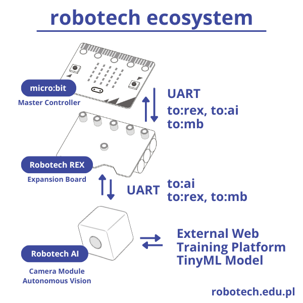

# Robotech REX & AI Extension for Microsoft MakeCode
Custom blocks for the advanced educational robotics ecosystem from **[
robotech.edu.pl](https://robotech.edu.pl)**.

## Hardware Overview & Architecture

The Robotech ecosystem utilizes a multi-processor, hardware-abstracted architecture designed to offload time-critical tasks from the micro:bit, ensuring smooth and robust robot operation.



<details>
<summary><b>Show text-based architecture diagram (ASCII)</b></summary>

```text
                      +-------------------+

                      |     micro:bit     |
                      | (Master Controller|
                      +---------+---------+
                                |
                                | UART (to:rex; / to:mb;)
                                v
                      +-------------------+

                      |   Robotech REX    |
                      |  Expansion Board  |
                      +---------+---------+
                                |
                                | UART Passthrough (to:ai;)
                                v
                      +-------------------+       +-------------------+

                      |    Robotech AI    |       |   External Web    |
                      |   Camera Module   | <.... |   Training Platform|
                      | (Autonomous Vision|       |  (TinyML Model)   |
                      +-------------------+       +-------------------+
```

</details>


This extension provides a hardware-abstracted block interface for the
**Robotech REX Expansion Board** paired with any **Universal Vision AI
Camera Module** running custom TinyML models.

---

### 1. Robotech REX Expansion Board
The micro:bit plugs directly into the **Robotech REX Expansion Board**, which acts as the main hardware interface and a smart bridge. The REX board features its own onboard microcontroller that handles all low-level, high-frequency, and timing-sensitive hardware operations autonomously:
* Driving high-torque DC motors.
* Coordinating multi-servo synchronized group movements (`S0-S3`).
* Managing timing-critical protocols like addressable RGB LEDs (WS2812B) and 1-Wire thermal sensors.
* Reading continuous multi-channel Analog-to-Digital Converter (ADC) values.

Any requested sensor readings or operational telemetry are packaged by the REX board and sent back asynchronously to the micro:bit via serial frames.

### 2. Autonomous Robotech AI Camera Module
For advanced computer vision tasks, the **Robotech AI Camera Module** is integrated into the system. Instead of consuming micro:bit's processing power, all image processing runs natively on the camera's dedicated AI hardware. 
* **Routing & Passthrough:** The micro:bit sends vision-related commands using the `to:ai;` prefix. The REX expansion board acts as a data pipeline, routing these frames directly to the AI camera.
* **Autonomous Processing:** The camera operates independently, managing its own Wi-Fi Access Point (AP), capturing image frames, and executing edge-computing algorithms natively.

### 3. TinyML Model Training & Workflow
The AI module supports a custom machine learning workflow tailored for educational AI learning:
1. **Image Collection:** The camera's built-in software allows students to snap images of various objects or environments.
2. **Data Export:** Collected images are transferred via the onboard Wi-Fi AP to a computer.
3. **Model Training:** Users import these images into the **robotech.edu.pl** specialized web platform for visual image recognition training. The model is trained entirely in the browser using interactive machine learning tools.
4. **Edge Deployment:** Once trained, the compiled TinyML model file is compiled and uploaded back onto the Robotech AI Camera Module.
5. **Real-Time Inference:** When running, the camera recognizes learned objects natively on-device and streams the real-time inference results (such as face detection flags and bounding box coordinates) back through the REX board to the micro:bit for block-level execution.

## UART Communication Protocol

The micro:bit communicates with the Robotech REX mainboard and the AI camera module using a lightweight, text-based serial protocol via UART (9600 baud, 8N1). 

### Frame Structure
Every data packet follows a strict modular blueprint separated by semicolons (`;`) and terminates with a newline character (`\n`):

1. **Target Identification** (`to:rex;`, `to:ai;`, or `to:mb;`) – Directs which subsystem must parse the upcoming data.
2. **Operation Type** (`cmd:...;` for output commands/requests or `res:...;` for input data responses).
3. **Data Parameters** (`parameter:value;`) – Key-value arguments specific to the current command.
4. **Line Terminator** (`\n`) – Emitted automatically by the MakeCode serial hardware wrapper.

---

### 1. Outbound Packets (From micro:bit TO Hardware)

#### Robotech REX Mainboard (`to:rex;`)
* **Group Servo Movement (S0-S3 angles + execution speed):**
  `to:rex;cmd:move;s0:90;s1:90;s2:90;s3:90;time:500;\n`
* **Pin Mode Setup (Universal Pins S0-S3):**
  `to:rex;cmd:pin-mode;pin:0;mode:out;\n` *(Supported modes: `out`, `in`, `pwm`, `adc`)*
* **Digital/PWM Output Control:**
  `to:rex;cmd:pin-write;pin:0;val:512;\n`
* **Trigger Analog-to-Digital Conversion (ADC):**
  `to:rex;cmd:adc-read;pin:1;\n`
* **DC Motor Speed & Direction:**
  `to:rex;cmd:motor;num:1;speed:50;\n` *(Speed range: `-100` to `100`)*
* **Addressable WS2812B RGB LED Control:**
  `to:rex;cmd:rgb;index:0;r:255;g:0;b:0;\n`
* **Request 1-Wire Thermal Sensor Readout:**
  `to:rex;cmd:1w-read;\n`

#### Robotech AI Module (`to:ai;`)
* **Snapshot Background Frame:**
  `to:ai;cmd:snap_bg;\n`
* **Snapshot Tracking Target Object:**
  `to:ai;cmd:snap_obj;\n`
* **Deploy Wi-Fi Access Point (AP):**
  `to:ai;cmd:ap_ON;ssid:robotech-AI;pass:123456789;\n`
* **Kill Wi-Fi Access Point (AP):**
  `to:ai;cmd:ap_OFF;\n`
* **Toggle Face Detection Algorithm:**
  `to:ai;cmd:face_detect_ON;\n` or `to:ai;cmd:face_detect_OFF;\n`
* **Camera Sensor Power Management:**
  `to:ai;cmd:camera;status:on;\n` or `to:ai;cmd:camera;status:off;\n`

---

### 2. Inbound Packets (From Hardware TO micro:bit)
Processed asynchronously inside the extension's background loop by filtering frames prefixed with `to:mb;`.

* **1-Wire Temperature Stream:**
  `to:mb;res:1w;temp:24;\n`
* **ADC Raw Voltage Reading:**
  `to:mb;res:adc;pin:1;val:512;\n`
* **Face Tracker Output (Active target locking with X,Y centroid coordinates):**
  `to:mb;res:face_detect;val:true;x:95;y:45;\n`
* **Face Tracker Target Lost:**
  `to:mb;res:face_detect;val:false;\n`


## License
MIT License. Open-source hardware and software ecosystem developed for
educational excellence at robotech.edu.pl.
